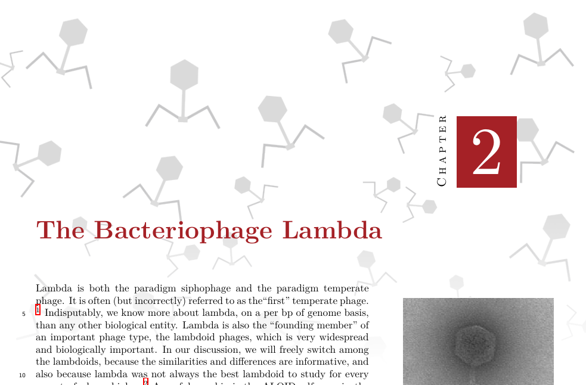
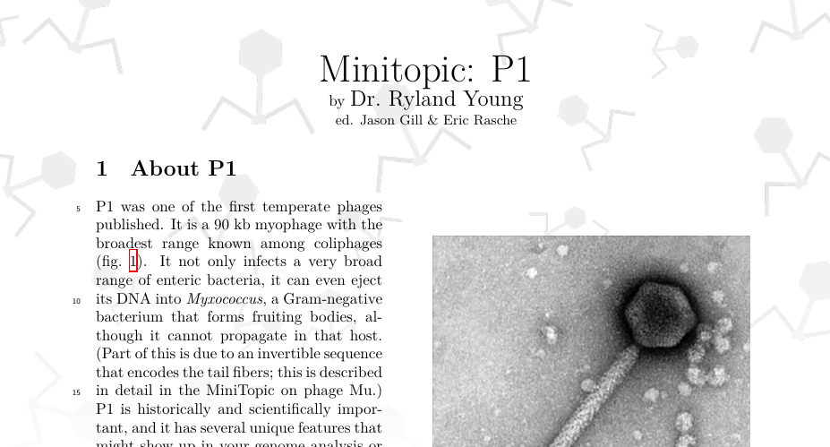
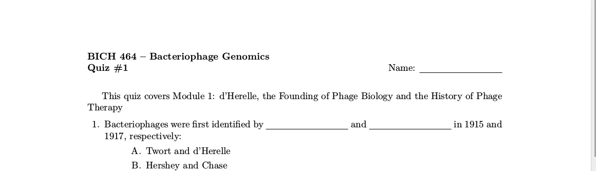
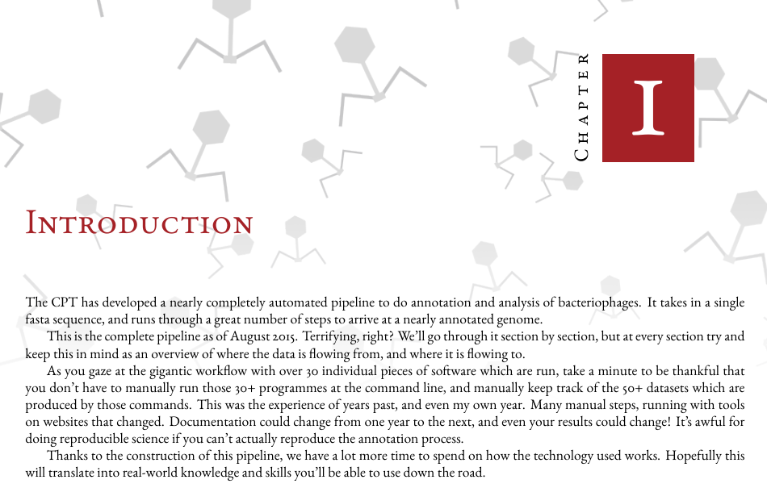
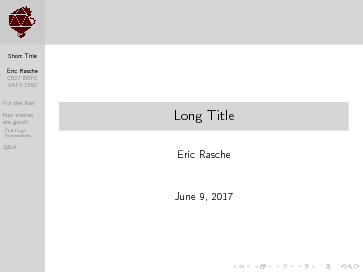

# CPT's LaTeX style repo 
Document classes for producing CPT affiliated documents. These let you easily
style your documents according to standard CPT practices.

## Scope

- Phage Textbook
- Minitopic/Article styles
- Protocols
- Official Documents

## Phage Textbook

Single column with sexy chapter headings, based on the memoir class

## Minitopic/Article

Single column, similar to the textbook except based on article instead of memoir.

## Quizzes

Simple quiz theme, no extreme customizations.

## Garamond

Use of the gorgeous Garamond font is also possible

## Slides

A customized beamer theme is likewise available

